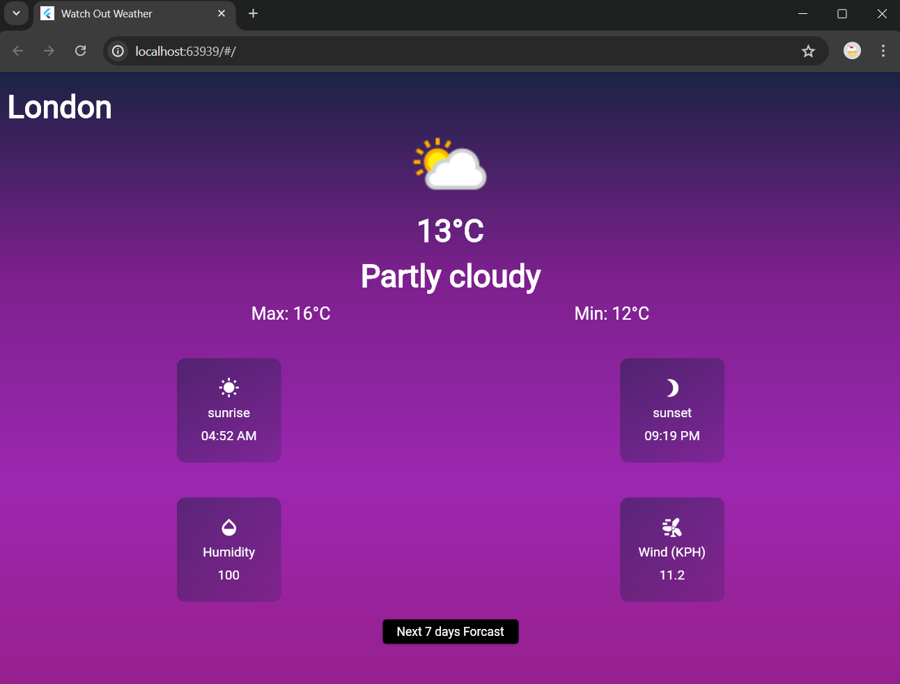
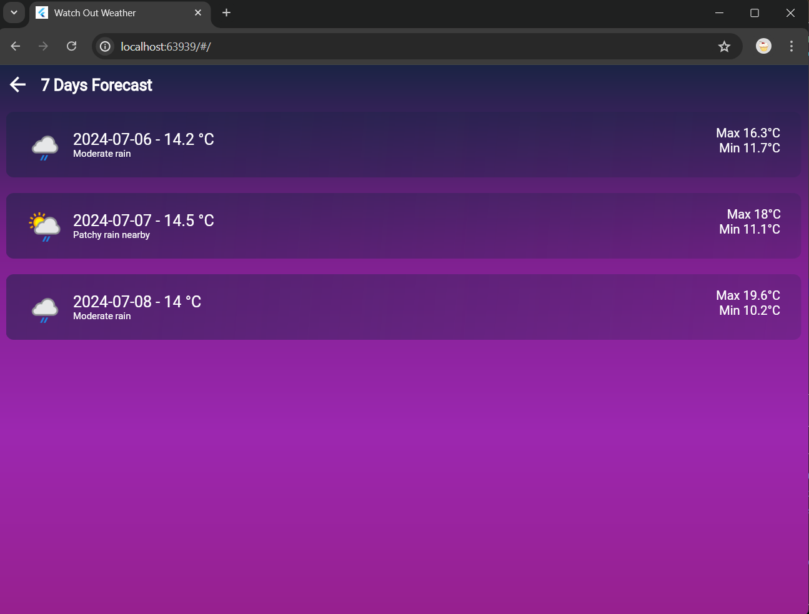

# watch_out_weather

WOW - Wheater Application

Flutter weather application fetches real-time data from a
weather API and displays the information to users in a clean
and intuitive interface. , the application offers a seamless  
experience, allowing users to quickly access weather details for
their location or search for other cities.

Implementation : 

